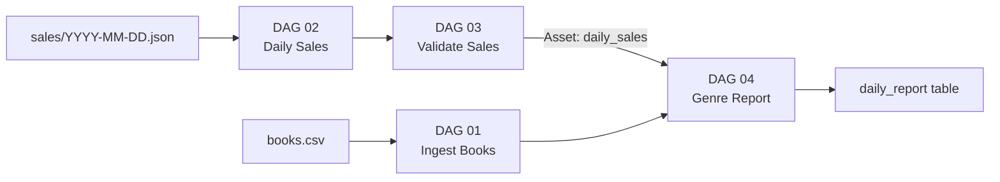

# Setup
## Data Pipelines with Apache Airflow 3.2
Clone or fork the repo, follow the Readme.md instructions

https://github.com/thelearningdev/pyconus-2026-apache-airflow-tutorial

or 

https://bit.ly/pycon2026-airflow-tutorial

---
layout: none
---

  

    <h1 style="color:white;font-size:3.5rem;font-weight:800;letter-spacing:-0.02em;margin:0;">Airflow</h1>
  

  

    <h1 style="color:#0a2540;font-size:3.5rem;font-weight:800;letter-spacing:-0.02em;margin:0;">Data Engineering</h1>
  

---
layout: blue-sidebar
---

::header::

# The Bookshop

::content::

### What the business wants

<v-clicks>

- Know which genres sell best each day
- Confidence that reruns do not duplicate rows
- Bad sales records flagged, not silently loaded
- Daily report ready without manual intervention

</v-clicks>

### What the team actually has

<v-clicks>

- A 25-row books catalog CSV with a few bad rows
- Daily JSON sales files that contain invalid records
- Scripts that are not scheduled and not observable
- No way to tell which day's data has already been loaded

</v-clicks>

---
layout: blue-sidebar
---

::header::

# In today's Session

::content::

1. Introduction to Apache Airflow
2. Data Ingestion & Idempotency
3. Backfill, incremental load and scheduling
4. Data validation and quarantine
5. Build Report

---
layout: blue-sidebar
---

::header::

# The Final Pipeline

::content::

At the end of this workshop we will have...

 

---
layout: title-slide
---

# Setup

Clone or fork the repo, follow the Readme.md instructions

https://github.com/thelearningdev/pyconus-2026-apache-airflow-tutorial

<!-- By now people should have apache airflow running in their system -->
