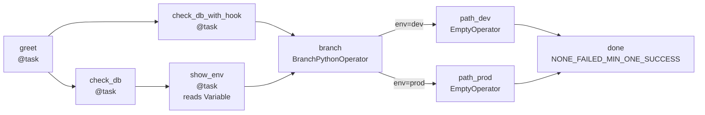

# Apache Airflow 101

---
layout: title-slide
---

# Hello World
## Core Airflow Concepts in One DAG

<div class="section-note">
Before the real pipeline, build one DAG that exercises every concept you will rely on.
</div>

---
layout: blue-sidebar
---

::header::

# The DAG — What We Are Building

::content::



---
layout: blue-title-slide
---

# Exercise 0
### Run the Hello World DAG

Trigger it, break it with a missing Variable, fix it, and watch which branch runs.

`dags/00_hello_world.py`

---
layout: blue-sidebar
---

::header::

# The DAG

::content::

```python
@dag(
    dag_id="00_hello_world",
    start_date=datetime(2026, 1, 1),
    schedule=None,       # manual trigger only
    catchup=False,
    tags=["workshop", "hello-world"],
)
def hello_world():
    ...

hello_world()            # registers the DAG with Airflow
```

<v-clicks>

- A DAG is a Python function decorated with `@dag`
- `schedule=None` means the DAG only runs when you click **Trigger DAG**
- `catchup=False` prevents Airflow from backfilling historical runs on first load
- The function call at the bottom instantiates and registers the DAG object

</v-clicks>

---
layout: blue-sidebar
---

::header::

# Tasks and Operators

::content::

<div class="balanced-cols">
<div>

### `@task` — Python shorthand

```python
@task
def say_hello() -> str:
    message = "Hello, Airflow 3!"
    print(message)
    return message
```

<v-clicks>

- Wraps a plain Python function as a task
- Return value is automatically stored as XCom
- Cleaner than instantiating `PythonOperator` directly

</v-clicks>

</div>
<div>

### `BashOperator` — run shell commands

```python
check_date = BashOperator(
    task_id="check_date",
    bash_command="echo 'Today: ' $(date)",
)
```

<v-clicks>

- Use when the work is a shell command, not Python
- `task_id` is how Airflow identifies the task in the UI and logs

</v-clicks>

</div>
</div>

---
layout: blue-sidebar
---

::header::

# XCom (Cross-Task Communication)

::content::

```python
@task
def say_hello() -> str:
    return "Hello, Airflow 3!"          # pushed to XCom automatically

@task
def log_greeting(greeting: str) -> None:
    print(f"Received: {greeting!r}")    # pulled from XCom automatically

greeting = say_hello()
log_greeting(greeting)                  # wire the return value directly
```

<v-clicks>

- XCom lets tasks share small values (strings, dicts, lists)
- With `@task`, passing a return value as an argument wires XCom transparently
- Keep XCom small — large datasets belong in storage, not in Airflow's metadata DB

</v-clicks>

---
layout: blue-sidebar
---

::header::

# Task Chaining

::content::

```python
greet_task = greet()
hook_task = check_db_with_hook()

greet_task >> hook_task >> branch
greet_task >> check_db() >> show_env() >> branch
branch >> [path_dev, path_prod]
[path_dev, path_prod] >> done
```

<v-clicks>

- `>>` declares a dependency: left must complete before right starts
- Putting tasks in a list `[a, b] >> c` means both `a` and `b` must finish
- Airflow resolves the full dependency graph before scheduling any task

</v-clicks>

---
layout: blue-sidebar
---

::header::

# BranchPythonOperator

::content::

```python
def _pick_branch() -> str:
    env = Variable.get("bookshop_env", default_var="dev")
    return "path_prod" if env == "prod" else "path_dev"

branch = BranchPythonOperator(
    task_id="branch",
    python_callable=_pick_branch,
)

branch >> [path_dev, path_prod]
```

<v-clicks>

- Returns the `task_id` (or a list) of the branch to follow
- Tasks on the unchosen path are **skipped**, not failed
- Real use cases: environment checks, feature flags, data-driven routing

</v-clicks>

---
layout: blue-sidebar
---

::header::

# Trigger Rules

::content::

```python
join = EmptyOperator(
    task_id="join",
    trigger_rule=TriggerRule.NONE_FAILED_MIN_ONE_SUCCESS,
)
```

<div class="balanced-cols" style="margin-top:1rem">
<div>

### Default: `ALL_SUCCESS`

<v-clicks>

- Every upstream task must succeed
- A skipped branch **blocks** the downstream task
- Works fine when there is no branching

</v-clicks>

</div>
<div>

### `NONE_FAILED_MIN_ONE_SUCCESS`

<v-clicks>

- No upstream task failed
- At least one upstream task succeeded
- Skipped tasks are acceptable — the join proceeds

</v-clicks>

</div>
</div>

<div class="exercise-why" v-click>
After a branch, always set <code>trigger_rule</code> on the join task, or Airflow will wait for a success that will never arrive.
</div>

---
layout: blue-sidebar
---

::header::

## Connections

::content::


1. A named, encrypted credential stored in Airflow. Your DAG code refers to it by ID — the actual host, port, and password live in the UI, not in the code
2. To create it, Go to Airflow UI → Admin → Connections → + Add. Set Conn ID to <code>bookshop_postgres</code>, Conn Type to <code>Postgres</code>

<br/>

<v-click>
Used when: The same DAG file works in dev and prod because the connection ID stays the same — only the credentials change per environment.
</v-click>

---
layout: blue-sidebar
---

::header::

## Providers

::content::

- Providers are python packages that follow airflow specs
- This enables airflow to connect, run task, pull data from an external system
- Common providers include `standard`, `postgres`, `aws`, `google`


---
layout: blue-title-slide
---

# Mini-Exercise

### Explore Provider Packages

https://airflow.apache.org/docs/#providers-packages


---
layout: blue-sidebar
---

::header::

# Airflow Architecture

- Scheduler
- API Server
- Executor/Worker
- Triggerers
- Dag Processor
- Metadata DB


::content::


---
layout: blue-sidebar
---

::header::

# Airflow Architecture


::content::

<v-clicks>

- **Scheduler** — continuously parses DAG files and queues tasks that are ready to run
- **API Server** — serves the UI and the REST API; reads state from the metadata DB
- **Executor** — decides where tasks run (same process, separate process, or remote worker)
- **Triggerer** — like worker, but for deferred tasks so it doesn't block other work
- **Dag processor** — serializes DAGs and makes them available to other components
- **Metadata DB** — the source of truth for all run history, XCom, connections, and variables

</v-clicks>

---
layout: blue-sidebar
---

::header::

# Executors

::content::

<div class="exercise-why">
This workshop uses <strong>SequentialExecutor</strong> — one task at a time, zero infrastructure setup. The same DAG file runs unchanged on LocalExecutor, CeleryExecutor, or KubernetesExecutor in production.
</div>

<v-clicks>

- **SequentialExecutor** — one task at a time; default for `airflow standalone`
- **LocalExecutor** — parallel tasks on a single machine; good for team development
- **CeleryExecutor / KubernetesExecutor** — distributed workers for production scale

</v-clicks>

<div class="caption" v-click>
The executor is an infrastructure concern, not a DAG concern. The same DAG file runs on any executor without changes.
</div>

---
layout: blue-sidebar
---

::header::

# Airflow: Reflections

::content::

<ul class="check-list">
  <li>Airflow pipeline concetps - Dag, Task, XCom, Variables, Connections...</li>
  <li>DAG Code Concepts - Chaining, Branching, Trigger Rules</li>
  <li>Airflow Infrastructure</li>
</ul>

> Airflow is still an orchestration engine, not a transformation engine
