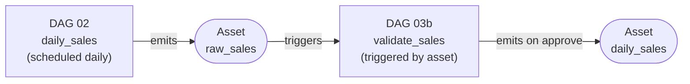

## Module 3
# Validate and Approve


---
layout: blue-title-slide
---

# Assets

---
layout: blue-sidebar
---

::header::

## Assets

::content::

<div class="panel pain">

**Problem:** Time-based schedules don't know if the upstream DAG finished.
A DAG scheduled at 6am might start before yesterday's data arrived.

</div>

<v-click>

<div class="panel action">

**Solution:** Assets -- a DAG declares what data it produces; downstream DAGs run when that data is ready, not on a clock.

</div>

</v-click>

---
layout: blue-sidebar
---

::header::

## Pipeline With Asset

::content::



<div class="caption" v-click>
DAG 03b does not run on a clock. It wakes up the moment DAG 02 marks <code>raw_sales</code> ready.
</div>p

---
layout: blue-sidebar
---

::header::

## Assets -- Producer

::content::

```python
@task(outlets=[Asset("raw_sales")])
def insert_sales(ds=None, **context):
    # ... insert rows ...

    # Attach metadata to the asset event
    context["outlet_events"][Asset("raw_sales")].extra = {
        "date": ds,
        "count": len(records),
    }
```

<v-click>

- `outlets` declares what this task produces
- `outlet_events[asset].extra` attaches a dict that travels with the event

</v-click>

---
layout: blue-sidebar
---

::header::

## Assets -- Consumer

::content::

```python
@dag(schedule=Asset("raw_sales"))   # fires when raw_sales is updated
def downstream():
    @task
    def print_event(**context):
        events = context["triggering_asset_events"][Asset("raw_sales")]
        print(events[0].extra)
        # {"date": "2026-05-01", "count": 5}
```

<v-clicks>

- `schedule=Asset(...)` replaces a cron string -- no fixed time needed
- `triggering_asset_events` gives the consumer access to the producer's extra data

</v-clicks>

---
layout: blue-title-slide
---

# Exercise 3a
### Asset Handoff


---
layout: blue-sidebar
---

::header::

## Data Quality

::content::

<div class="concept-shell">
  <div class="concept-step warning">
    <strong>Bad data is worse than no data</strong>
    <p>A negative quantity silently loaded into <code>daily_sales</code> skews every report downstream. By the time someone notices, the damage is done.</p>
  </div>
  <div class="concept-step" v-click>
    <strong>What our sales files contain</strong>
    <p>Each daily JSON has 10 records. Two are bad: one has <code>quantity: -2</code> and one references an ISBN not in the books catalog.</p>
  </div>
  <div class="concept-step action" v-click>
    <strong>The goal</strong>
    <p>Insert clean records. Quarantine bad ones with a reason. Then pause and ask a human -- should we proceed?</p>
  </div>
</div>

---
layout: blue-sidebar
---

::header::

## Validate & quarantine

::content::


- One loop. Valid rows go to <code>daily_sales</code>. Bad rows go to <code>sales_quarantine</code>. 
- If sale is negative or book is unknown quarantine the row 


---
layout: blue-sidebar
---

::header::

## Human-in-the-Loop

::content::

```python
from airflow.providers.standard.operators.hitl import ApprovalOperator

approve = ApprovalOperator(
    task_id="approve_or_reject",
    subject="Quarantined sales records require your review",
    body="""
Date: {{ ds }}

{{ ti.xcom_pull(task_ids='validate_and_insert') }}

Approve to continue. Reject to stop this run.
    """,
    outlets=[Asset("daily_sales")],
    response_timeout=timedelta(hours=24),
)
```

<div class="concept-shell" style="margin-top:0.5rem">
  <div class="concept-step action" v-click>
    <p>Airflow pauses the DAG and shows the quarantine table -- pulled from XCom -- inside an Approve/Reject form. No external tools needed.</p>
  </div>
  <div class="concept-step success" v-click>
    <strong>On Approve</strong>
    <p>The <code>daily_sales</code> asset is emitted and DAG 04 triggers automatically.</p>
  </div>
</div>

---
layout: blue-title-slide
---

# Exercise 3b
### Validate Sales + Human-in-the-Loop

Split valid and bad records, quarantine the bad ones, then approve in the Airflow UI.

`dags/03b_validate_sales_starter.py`

---
layout: blue-sidebar
---

::header::

# Data Validation

::content::

<ul class="check-list">
  <li>Data Validation &amp; Quarantining </li>
  <li>Assets</li>
  <li>HITL</li>
</ul>

---
layout: blue-sidebar
---

::header::

# Next Goal

::content::

```python
known_isbns = {row[0] for row in hook.get_records("SELECT isbn FROM books")}

valid_rows, bad_rows = [], []
for rec in records:
    if rec["quantity"] <= 0:
        bad_rows.append(...)
    elif rec["isbn"] not in known_isbns:
        bad_rows.append(...)
    else:
        valid_rows.append(...)
```

- What happens if the sales records grow in size? Instead of 10 sales, we get 10K sales.
- What if we want to parallelize the validation?
- Ideal way is to use SQL
- But is there an Airflow construct?
