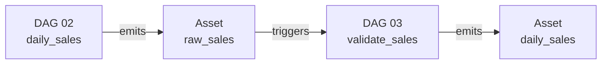
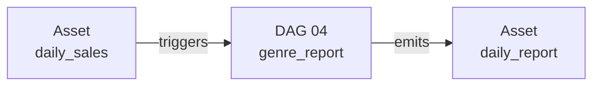

## Module 4
# Generate Report

---
layout: blue-sidebar
---

::header::

## Genre Report as a For-Loop

::content::

```python
@task
def genre_report():
    genres = get_genres()   # ["Fiction", "Mystery", "Science", ...]
    for genre in genres:
        build_genre_report(genre)
```

<div class="concept-shell" style="margin-top:0.75rem">
  <div class="concept-step warning">
    <strong>Sequential by default</strong>
    <p>All genres run one after another inside a single task. The entire loop must finish before any result is visible in the UI.</p>
  </div>
  <div class="concept-step warning" v-click>
    <strong>All-or-nothing retry</strong>
    <p>If one genre fails, the whole task fails. Every genre re-runs on retry — even the ones that already succeeded.</p>
  </div>
  <div class="concept-step warning" v-click>
    <strong>Zero visibility</strong>
    <p>Airflow shows one opaque task block. You cannot tell which genre is running, which finished, or which failed.</p>
  </div>
</div>

---
layout: blue-sidebar
---

::header::

## Dynamic Task Mapping

::content::

<v-clicks>

**Step 1** - extract the loop body into its own `@task`

```python
@task
def build_genre_report(genre): 
  ...
```

**Step 2** - get the list

```python
@task
def get_genres():
    hook = PostgresHook(postgres_conn_id="bookshop_postgres")
    rows = hook.get_records("SELECT DISTINCT genre FROM books WHERE genre IS NOT NULL")
    return rows
```

**Step 3** - replace the loop with `.expand()`

```python
genre_rows = build_genre_report.expand(genre=genres)
#                                             ^ one task instance per genre
```

</v-clicks>

<div class="concept-shell" style="margin-top:0.5rem">
  <div class="concept-step action" v-click>
    <strong>Parallel by default</strong>
    <p>Airflow creates one task instance per genre at runtime. They run in parallel, each with its own log and retry.</p>
  </div>
</div>


---
layout: blue-title-slide
---

# Exercise 4
### Build the Genre Report

Aggregate sales per genre using `.expand()`, then watch DAG 04 trigger automatically when DAG 03 approves.

`dags/04_genre_report_starter.py`


---
layout: blue-sidebar
---

::header::

# Generate Report

::content::

<ul class="check-list">
  <li>Dynamic Task Mapping</li>
  <li>Assets</li>
  <li>HITL</li>
</ul>

---
layout: blue-sidebar
---

::header::

## Final Pipeline

::content::





<v-clicks>

- Every downstream DAG wakes up on data, not on a clock
- Open Airflow UI **Assets** tab to see this graph live
- If any DAG fails, nothing downstream runs on stale data
- Each DAG can be maintained, retried, and tested independently

</v-clicks>
