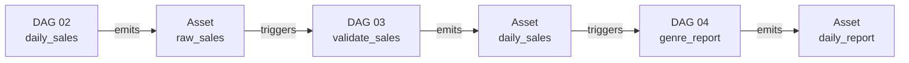

## Module 4
# Genre Report

---
layout: blue-sidebar
---

::header::

## Dynamic Task Mapping

::content::

<div class="concept-shell">
  <div class="concept-step warning">
    <strong>The problem with a for-loop</strong>
    <p>If you aggregate each genre inside a Python loop, all 5 genres run sequentially in one task. You cannot retry a single genre, and the UI shows one opaque task.</p>
  </div>
  <div class="concept-step action" v-click>
    <strong>The better way: .expand()</strong>
    <p>Tell Airflow to run <code>build_genre_report</code> once per genre. Airflow creates one task instance per value at runtime. They run in parallel, and each has its own log and retry.</p>
  </div>
</div>

```python
genres = get_genres()                          # returns ["Fiction", "Mystery", ...]
genre_rows = build_genre_report.expand(genre=genres)
#                                             ^ one task instance per genre
```

<div class="caption" v-click>
The number of mapped tasks is only known at runtime. Airflow shows them as <code>build_genre_report[0]</code>, <code>build_genre_report[1]</code>, etc. in the UI.
</div>

---
layout: blue-sidebar
---

::header::

## Assets Recap — The Full Pipeline

::content::



<v-clicks>

- Every downstream DAG wakes up on data, not on a clock
- Open Airflow UI **Assets** tab to see this graph live
- If any DAG fails, nothing downstream runs on stale data
- Each DAG can be maintained, retried, and tested independently

</v-clicks>

---
layout: blue-sidebar
---

::header::

## Consuming an Asset

::content::

```python
# DAG 03 emits daily_sales when the human approves
approve = ApprovalOperator(
    task_id="approve_or_reject",
    outlets=[Asset("daily_sales")],
    ...
)

# DAG 04 wakes up the moment daily_sales is updated
@dag(
    dag_id="04_genre_report",
    schedule=Asset("daily_sales"),
    catchup=False,
)
def genre_report(): ...
```

<v-clicks>

- `schedule=Asset(...)` replaces a cron string entirely
- `catchup=False` is correct here — the asset event itself carries the context
- The run is linked to the asset update in the UI for full traceability

</v-clicks>

---
layout: blue-title-slide
---

# Exercise 4
### Build the Genre Report

Aggregate sales per genre using `.expand()`, then watch DAG 04 trigger automatically when DAG 03 approves.

`dags/04_genre_report_starter.py`

---
layout: blue-title-slide
---

# After Exercise 4

<div class="big-idea">
Five genre tasks ran in parallel.
<br>
<span v-click>DAG 04 started automatically the moment DAG 03 finished loading data.</span>
</div>

<div v-click class="subtle-line">
The full pipeline now runs end to end, triggered by data, not by clocks.
</div>
